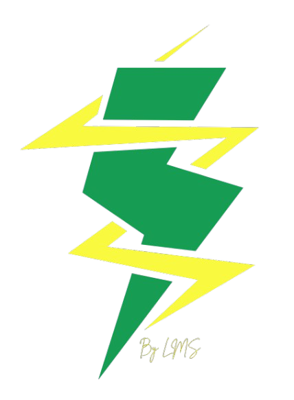

# TrackMyWatts by LMS



TrackMyWatts is a personal, full-stack web application designed to digitize and analyze home electricity consumption. It provides a comprehensive solution for tracking multiple meter readings, managing bi-monthly billing cycles, and calculating costs based on configurable, slab-based tariff structures to help strategize and optimize electricity usage.

**Live Application:** [**https://trackmywatts.onrender.com**](https://trackmywatts.onrender.com)

---

## Key Features

- **Dynamic Dashboard:** An at-a-glance overview of the current billing cycle, total estimated bill, and detailed real-time statistics for each meter.
- **Comprehensive Readings Management:**
    - Add new readings with an IST-aware date and time picker.
    - View a complete history of all readings with pagination.
    - Filter readings by specific meter or date range.
    - Delete individual readings or all readings with secure confirmation modals.
- **Billing Cycle Control:**
    - A dedicated page to view the history of all past billing cycles.
    - Manually start a new billing cycle (essential for initial setup or after clearing data).
    - Close the current active cycle to automatically start a new one, simulating the real-world billing process.
- **Advanced Settings & Configuration:**
    - **Meter Strategy:** Switch the active general-purpose meter to strategically manage consumption and avoid higher tariff brackets.
    - **Slab Rate Management:** Full CRUD (Create, Read, Update, Delete) functionality for electricity tariff structures. Add new slab rate configurations with dynamic rules for different consumption levels.
- **Data Analytics:** A dedicated analytics page with charts to visualize historical consumption and costs per billing cycle, turning raw data into actionable insights.
- **Responsive Design:** A mobile-first interface built with TailwindCSS ensures a seamless experience on both desktop and mobile devices.
- **Modern User Experience:** Features clean user feedback through toast notifications for all actions.

---

## Technology Stack

This project is a full MERN stack application deployed as a single service.

- **Frontend:**
    - **React** (with Vite)
    - **React Router** for page navigation
    - **TailwindCSS** for styling
    - **Recharts** for data visualization
    - **Axios** for API communication
    - **React-Toastify** for user notifications

- **Backend:**
    - **Node.js**
    - **Express.js** for the REST API
    - **MongoDB Atlas** as the cloud database
    - **Mongoose** as the Object Data Modeler (ODM)

- **Deployment:**
    - **Render.com** as the hosting platform (configured as a single Web Service).
    - **Git & GitHub** for version control.

---

## Local Setup and Installation

To run this project on your local machine, follow these steps.

### Prerequisites

- [Node.js](https://nodejs.org/) (v18.x or later recommended)
- `npm` (comes with Node.js)
- A `MONGODB_URI` connection string from a MongoDB Atlas account.

### Installation

1.  **Clone the repository:**
    ```bash
    git clone [https://github.com/sabith2000/track-my-watts.git](https://github.com/sabith2000/track-my-watts.git)
    cd track-my-watts
    ```

2.  **Backend Setup:**
    - Navigate to the server directory:
      ```bash
      cd server
      ```
    - Install backend dependencies:
      ```bash
      npm install
      ```
    - Create a `.env` file in the `server` directory and add your MongoDB connection string:
      ```
      # /server/.env
      MONGODB_URI=your_mongodb_connection_string_here
      PORT=5001
      ```
    - Start the backend server:
      ```bash
      npm start
      ```
      The server will be running on `http://localhost:5001`.

3.  **Frontend Setup:**
    - Open a **new terminal** and navigate to the client directory from the project root:
      ```bash
      cd client
      ```
    - Install frontend dependencies:
      ```bash
      npm install
      ```
    - The frontend is already configured to proxy API requests to the backend. No `.env` file is needed for the client in local development.
    - Start the frontend development server:
      ```bash
      npm run dev
      ```
      The application will be accessible at `http://localhost:5173` (or another port if 5173 is in use).

---

After creating this file, you can commit it and push it to your GitHub repository. It will then appear as the front page of your repository, professionally explaining your project to anyone who visits.